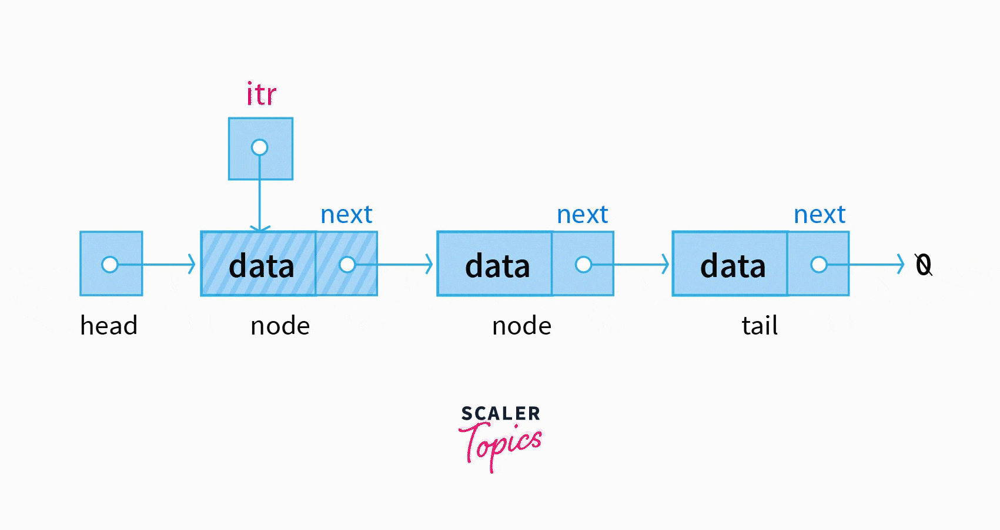
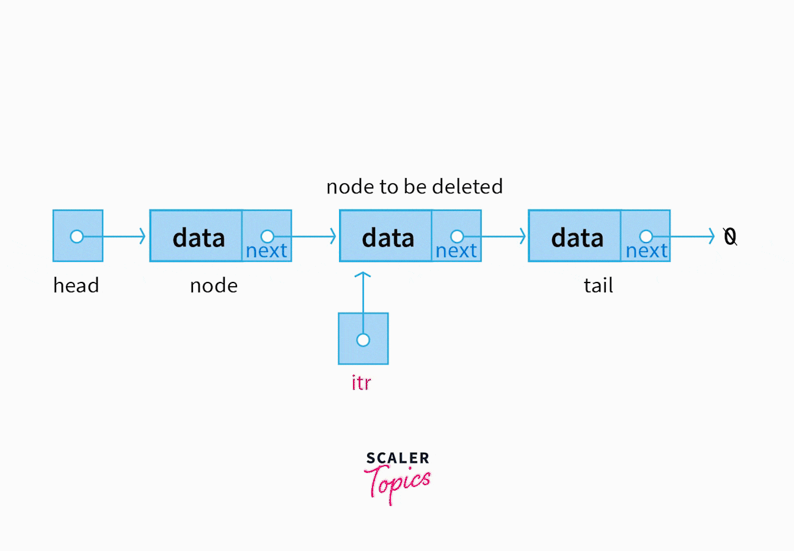
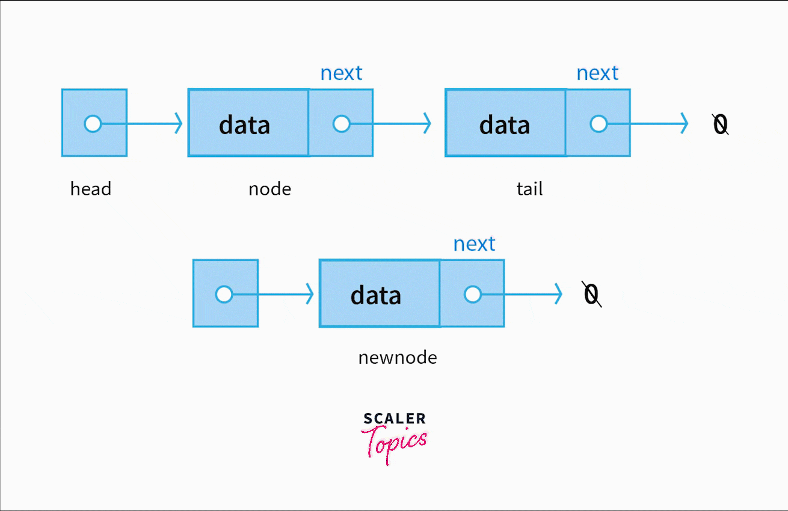

# [What is an ADT?](#abstract-data-structures-adt) | [Bags and Sets](#bags-and-sets ) | [Stacks](#stacks) | [Queues](#queues) | [Linked Lists](#linked-lists)
### <center> Saaim Japanwala | CMPUT 175
# Abstract Data Structures (ADT)
- **a way to structure data and data types which stores and emits data effeciently or according to the speed/storage a program or algorithm needs.**
- provides a framework for data
- speed up and make operations more effecient

# Bags and Sets
- a bag or a set is one of the simplest data stuctures
- **are not ordered or sorted by any means**
- items can be added, removed, or accessed
- **duplicates are only allowed in bags (lists and tuples)**
- sets have different operations 
    * union - everything in the set of a and b
    * intersection - only the shared items in the set of a an b
    * difference - the differences in the set of a and b
    * subset - a set inside of the set of a and b
```py
# Example of a bag
aList = []
aList.append(15) # adding to a bag
aList.pop() # removing from the bag
aList[0] # accessing from the bag
```
```py
# Example of sets
a = {1,3,5,7,9} # odd numbers
b = {3,6,9,12,15} # multiples of 3
union = a | b # this is an union set
intersection = a & b # this is an intersection set
difference = a - b # this is a difference set
subset = intersection # this is a subset containing only intersecting values
```

# Stacks

## What is a Stack?
- a collection with access only to the last element inserted
- **Last In First Out - (LIFO)**
    * kind of like stacking pancakes, you cant take the middle pancake or the bottom pancake, you have the best access to the top pancake
- inserting on the top, access from the top, deleting from the top.

<p align="center">
  
  
</p>


## Stack Codes

- Adding an Element. / push(item)
    * adds an item to a stack
    * adds it to the tail end of the stack
    * [1, 2, 3, 4, (added here)]
- Removing an Elements. / pop()
    * removes an element from a stack
    * removes it from the tail end of the stack
    * [1, 2, 3, 4, (remove here)]
- Creating a Stack. / Stack()
    * creates a new empty stack
- Look at the Last Item. / peek()
    * looks at the last item from a stack
    * stack[-1]
- Boolean on a Stack. / isEmpty()
    * returns a boolean value to show if a stack has items or not
    * return True  -> if queue is empty
    * return False -> if queue is not empty
- Size of a Stack. / size()
    * returns how many items are in the stack

## Time Complexity
- **linear structure**
- **O(N)**
- grow and shrink one element at a time

## Applications and Usages Of Stacks
- reversing sequences
    * flipping a list from [1,2,3] to [3,2,1]
    * reversing a maze, or a process
    * web features, tabs

```py
myList = [] # makes an empty list

def peek(aList):       # the peek function looks at the 
    return(aList[-1])  # last item in the list

myList.pop()           # pop is a built in function
                       # removes the last item in the list
```

<p align="center">


# Queue's
## What is a Queue?
- a collection of items with access to only the front elements of a list.
- **First in First Out - (FIFO)**.
- opposites to stacks, while stacks are used as a last in first out, queues work with a first in first out system.
- a new element is only allowed to **join the queue on one end called the ***tail*** which is on the right**. The **Oldest element must leave the queue from the opposite end**. When an element leaves the queue, then all of its **followers shift by exactly one position towards the ***head*** of the queue**. 
    * think of it as lining up to wait your turn, you would join the end of the line, and the person infront of the line will have their turn first/ or leave the line first and everyone else will move up the line

<p align="center">


</p>

## Queue Types
- Unbounded
    * unbounded queues are regular queues
    * no limit on how many items you can enqueue into the que
- Bounded 
    * bounded queues are limited to a fixed number of items
    * the capacity is fixed at a creation of a queue and cannot be changed
    * see the image below on how the capacity of the queue is only 3, when another item tries to get in, its blocked, unless there is room in the queue
    

## Queue Codes
- Adding an Element. / Enqueue(item)
    * adds an element into the queue
    * adds it to the tail end of a queue
    * [1, 2, 3, 4, (added here)]
- Removing an Element. / Dequeue()
    * removes an element from the queue
    * removes it from the head end of a queue
    * [ (removes here), 2, 3, 4 ,5]
- Creating a Queue. / Queue()
    * creates a new que to be used
    * doesnt need parameters and will alwas return an empty que
    * queue = []
- Boolean on a Queue. / isEmpty()
    * returns a boolean value to show if a queue has items or not
    * return True  -> if queue is empty
    * return False -> if queue is not empty
- Size of a Queue. / size()
    * returns how many items are in the queue
- Clear out a Queue. / clear()
    * clears a que and returns it

## Time Complexity
- ques have a deque function which is basically pop from stacks, but acts on the first item in the list instead. (removes the first item in the list)
- dequeueing is more or an effecient way to "pop" items from a list because **its time complexity is O(1)**, or constant.

## Applications 
<p align="center">

</p>


```py
class Queue:
    def __init__(self):
        self.items = []

    def enqueue(self, item):
        self.items.insert(0,item)

    def dequeue(self):
        return self.items.pop()
    def isEmpty(self):
        return self.items == []

    def size(self):
        return len(self.items)

    def clear(self):
        self.items=[]
```

# Linked Lists
#### Nodes: Nodes are a basic data structure which contain data and one or more links to other nodes. Nodes can be used to represent a tree structure or a linked list. In such structures where nodes are used, it is possible to traverse from one node to another node.
## Recapping Lists
- lists are a built in data structure that store elements in a continuous line
- also called an array
- time complexity for a list
    - accessing data is O(1)
    - but insertion and deletion is O(n) because you have to shift elements n times
## Single Linked Lists
- long chain of nodes
- each node contains two parts
    - data to store
    - a pointer to connect to the next node in line
    - they dont have indexes like regular arrays do
    - they are non-contiguous, and can be anywhere in your computers memory  
- begin at the head and follow through until our tail has the address of NUL
- inserting and deleting a node is easier because we dont have to shift any contents, we just redirect thier addresses to different addresses
### Time Complexities

## Doubly Linked Lists
- A doubly linked list is a type of data structure that consists of a sequence of elements, where each element (commonly called a node) contains data and two pointers (or references). 
- These pointers link the node to the next node and the previous node in the sequence. This allows traversal in both directions, forward and backward.
- long chain of nodes
- each node has three parts
    - data to store
    - a head pointer
    - a tail pointer
### Time Complexities
- Insertion:
    - At the beginning: O(1)
    - At the end: O(1) if the tail is maintained, otherwise O(n)
    - At a specific position: O(n) (requires traversal)
- Deletion:
    - At the beginning: O(1)
    - At the end: O(1) if the tail is maintained, otherwise O(n)
    - At a specific position: O(n) (requires traversal)
- Traversal:
    - Forward: O(n)
    - Backward: O(n)
- Search:
    - O(n) (requires traversal)

## <center> Summary Of Linked Lists and Time Complexities

<p align="center">

| Operation               | Singly Linked List | Doubly Linked List |
|-------------------------|--------------------|--------------------|
| Insertion at beginning  | O(1)               | O(1)               |
| Insertion at end        | O(n) / O(1)*       | O(n) / O(1)*       |
| Insertion at position   | O(n)               | O(n)               |
| Deletion at beginning   | O(1)               | O(1)               |
| Deletion at end         | O(n) / O(1)*       | O(n) / O(1)*       |
| Deletion at position    | O(n)               | O(n)               |
| Traversal (forward)     | O(n)               | O(n)               |
| Traversal (backward)    | N/A                | O(n)               |
| Search                  | O(n)               | O(n)               |
(*) denotes time complexity when a tail pointer is maintained.
</p>

## <center> Visualization of Single Linked Lists
### <center> Iteration Through a Linked List(s)     |     Removal Of A Node From A Linked List     |     Adding a Node Into A Linked List
<div style="display: flex; justify-content: space-around;">
    <figure style="text-align: center; width: 30%;">
        
        <figcaption>Iterating Linked List</figcaption>
    </figure>
    <figure style="text-align: center; width: 30%;">
        
        <figcaption>Deleting Node</figcaption>
    </figure>
    <figure style="text-align: center; width: 30%;">
        
        <figcaption>Adding to Linked List</figcaption>
    </figure>
</div>


