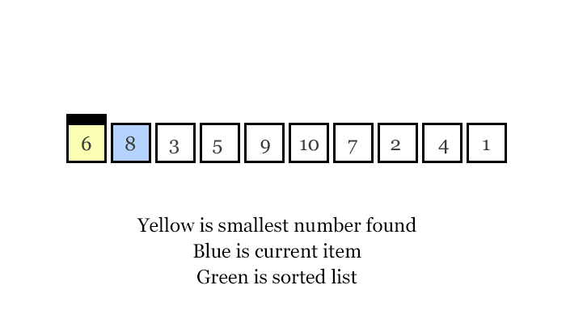

# <center>[Merge Sort](#merge-sort) | [Quick Sort](#quick-sort) | [Bubble Sort](#bubble-sort) | [Insertion Sort](#insertion-sort) | [Selection Sort](#selection-sort)
## <center> Saaim Japanwala | CMPUT175
### <center> [In a Hurry? Watch This Playlist](https://www.youtube.com/playlist?list=PL9xmBV_5YoZOZSbGAXAPIq1BeUf4j20pl)
## Merge Sort
- ### Done recursivly
    * using the divide and conquer method
        * break items into smaller items
        * to get to a basecase
- ### Steps
    - Divide
        * divide an array into 2's until you are down to one element
        * [4, 2, 1, 3]
        * [4, 2] [1, 3]
        * [4] [2] [1] [3]
    - Conquer and Compare
        * compare the smaller arrays with each  other, and sort them like so
        * 4 > 2, 1 < 3### Done Recursively
            * pivoting
    - Combine
        * after they are compared, combine them into smaller arrays until you build upto the final array
        * [2, 4] [1, 3]
        * [1, 2, 3, 4]
- ### Time & Space Complexity
    - merge sort uses the time complexity of O(n logn)
    - only requires the space for the input size

<p align="center">

</p>

- ### Advantages
    - Efficient for large datasets due to its O(nlogn) time complexity.
    - Stable sorting algorithm.
    - Well-suited for sorting linked lists due to its sequential access pattern.
- ### Disadvantages
    - Requires additional space proportional to the size of the input list.
    - May not be as efficient for small datasets or datasets that are already partially sorted.
### Text Based Visualization
``` py
[2, 8, 5, 3, 9, 4, 1, 7]
# divide this array into 2
[2, 8, 5, 3] [9, 4, 1, 7]
# divide this array into 2
[2, 8] [5, 3] [9, 4] [1, 7]
# divide this array into 2
[2] [8] [5] [3] [9] [4] [1] [7]
# we keep recursivly dividing until we are down to a single item
# now you can sort, compare values and merge them into temporary arrays
[2] [8] [5] [3] [9] [4] [1] [7]
# merge them together, they will compare and merge
[2, 8] [3, 5] [4, 9] [1, 7]
# merge them together, they will compare and merge
[2, 3, 5, 8] [1, 4, 7, 9]
# merge them together, they will compare and merge
[1, 2, 3, 4, 5, 7, 8, 9]
# until you have assembled the array with no more divisions and its all sorted
```
### Code
``` py
def merge_sort(arr):
    if len(arr) > 1:
        mid = len(arr) // 2
        left_half = arr[:mid]
        right_half = arr[mid:]

        # Recursive calls to divide the array into smaller sublists
        merge_sort(left_half)
        merge_sort(right_half)

        # Merge the sorted sublists
        i = j = k = 0
        while i < len(left_half) and j < len(right_half):
            if left_half[i] < right_half[j]:
                arr[k] = left_half[i]
                i += 1
            else:
                arr[k] = right_half[j]
                j += 1
            k += 1

        # Add remaining elements from left_half
        while i < len(left_half):
            arr[k] = left_half[i]
            i += 1
            k += 1

        # Add remaining elements from right_half
        while j < len(right_half):
            arr[k] = right_half[j]
            j += 1
            k += 1

# Example usage:
arr = [2, 9, 5, 4, 8, 1, 6, 7]
print("Original array:", arr)
merge_sort(arr)
print("Sorted array:", arr)
```

# Quick Sort
### Done Recursively
- pivoting
    * an item in an array that meets the following conditions afer its sorted
        * Conditions
        * 1. correct position in its sorted array
        * 2. items to the left are smaller
        * 3. items to the right are larger

### Pivots and Partitioning
- Choosing a Pivot: 
    - The first step in quick sort is to choose a pivot element from the array. There are different strategies for choosing the pivot, but a common one is to select the first element, the last element, or a randomly chosen element from the array.
- Partitioning: 
    - Once the pivot is chosen, the next step is to partition the array into two sub-arrays: one containing elements less than the pivot and the other containing elements greater than the pivot. During the partitioning process, elements are rearranged such that all elements less than the pivot are placed before it, and all elements greater than the pivot are placed after it. At the end of the partitioning process, the pivot is placed in its final sorted position.
- Recursion: 
    - After partitioning, the algorithm recursively sorts the sub-arrays created from the partition step. This process continues until all sub-arrays have only one element, which means the entire array is sorted.
- Combining: 
    - As the recursion unfolds, the sorted sub-arrays are combined to form the final sorted array.

### Time Complexity
- Best case scenario: O(n logn)
- Worst case scenario: O(n²)
<p align="center">

</p>

### Visual Examples
## <center> [Click This Link and Watch This Video For A Visual Explanation](https://www.youtube.com/watch?v=WprjBK0p6rw&ab_channel=CuriousWalk)

<p align="center">

</p>

### Code
``` py
def quick_sort(arr):
    if len(arr) <= 1:
        return arr
    else:
        pivot = arr[0]
        less_than_pivot = [x for x in arr[1:] if x <= pivot]
        greater_than_pivot = [x for x in arr[1:] if x > pivot]
        return quick_sort(less_than_pivot) + [pivot] + quick_sort(greater_than_pivot)

# Example usage:
arr = [3, 6, 8, 10, 1, 2, 1]
sorted_arr = quick_sort(arr)
print(sorted_arr)
```

## Bubble Sort
### Not Done Recursivly 
- uses loops instead of recursion
### Iterations
- uses loops to iterate over items
- called bubble sort because the largest value "bubble" to the end
- compares 2 items, if item 1 is larger than item 2, they swap
    * 3, 1, 7, 6 - 3 and 1 will compare and they will swap
    * 1, 3, 7, 6 - 3 and 1 swapped, now 3, 7 will compare
    * 1, 3, 7, 6 - 3 and 7 didnt swap, 7 and 6 will compare
    * 1, 3, 6, 7 - 6 and 7 swapped, 7 is the highest value, so it "bubbled" to the top
    * this will keep going till the loop finished/ all items are organised

### Visual Examples
## <center> [Click This Link and Watch This Video For A Visual Explanation](https://www.youtube.com/watch?v=nmhjrI-aW5o&ab_channel=GeeksforGeeks)
<p align="center">
    
</p>

### Code

``` py
def bubble_sort(arr):
    n = len(arr)
    # Traverse through all elements in the list
    for i in range(n):
        # Last i elements are already in place, so we don't need to check them
        for j in range(0, n - i - 1):
            # Traverse the list from 0 to n-i-1
            # Swap if the element found is greater than the next element
            if arr[j] > arr[j + 1]:
                arr[j], arr[j + 1] = arr[j + 1], arr[j]  # Swap elements

# Example usage:
arr = [64, 34, 25, 12, 22, 11, 90]
bubble_sort(arr)
print("Sorted array is:", arr)
```

## Insertion Sort
### How it works,
-   compares data from right to left
-   stars sorting from  left to right
-   inserts an item when item a is greater than item b
    * [a, b]
    * if a > b  ->  [b, a]
    * if b > a  ->  [a, b]
### Time Complexity  
- Best Case Scenario: O(n)
- Worst Case Scenario: O(n²)
<p align="center">

</p>

### Advantages
- Simple and easy to implement.
- Stable sorting algorithm.
- Efficient for small lists and nearly sorted lists.
- Space-efficient.

### Disadvantages
- Inefficient for large lists.
- Not as efficient as other sorting algorithms (e.g., merge sort, quick sort) for most cases.

### Visual Examples
## <center> [Click This Link And Watch This Video For A Visual Explantaion](https://www.youtube.com/watch?v=OGzPmgsI-pQ&ab_channel=GeeksforGeeks)

<p align="center">

</p>

### Code 

```py
# Python program for implementation of Insertion Sort

# Function to do insertion sort
def insertionSort(arr):

    # Traverse through 1 to len(arr)
    for i in range(1, len(arr)):

        key = arr[i]

        # Move elements of arr[0..i-1], that are
        # greater than key, to one position ahead
        # of their current position
        j = i-1
        while j >= 0 and key < arr[j] :
                arr[j + 1] = arr[j]
                j -= 1
        arr[j + 1] = key


# Driver code to test above
arr = [12, 11, 13, 5, 6]
insertionSort(arr)
for i in range(len(arr)):
    print ("% d" % arr[i])

```

# Selection Sort
### What it is
- Selection sort is a simple and efficient sorting algorithm that works by repeatedly selecting the smallest (or largest) element from the unsorted portion of the list and moving it to the sorted portion of the list. 
### How it works
- The algorithm repeatedly selects the smallest (or largest) element from the unsorted portion of the list and swaps it with the first element of the unsorted part. This process is repeated for the remaining unsorted portion until the entire list is sorted. 
<p align="center">

</p>

### Time Complexity
- Time Complexity (bestcase,avgcase,worstcase): O(n²)
<p align="center">

</p>

### Code
```py 
# Sort
A = [64, 25, 12, 22, 11]

# Traverse through all array elements
for i in range(len(A)-1):
    
    # Find the minimum element in remaining 
    # unsorted array
    min_idx = i
    for j in range(i+1, len(A)):
        if A[min_idx] > A[j]:
            min_idx = j
            
    # Swap the found minimum element with 
    # the first element        
    A[i], A[min_idx] = A[min_idx], A[i]

# Driver code to test above
print ("Sorted array")
for i in range(len(A)):
    print(A[i],end=" ") 
```

