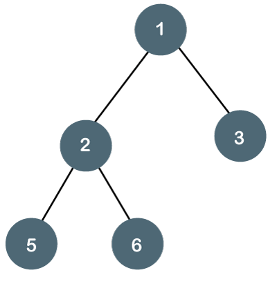
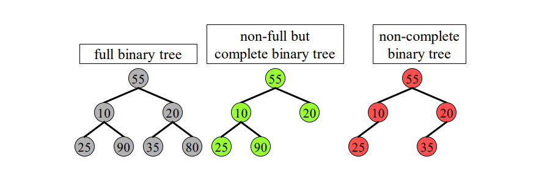

# Trees

## What Are Trees?
- trees are an abstract daa structure (ADT) that simulates a hierchial tree structure with a set of connected nodes.

## Terminology And Definitions
- Node
    * a node is a fundemental part of the tree
    * contains the actual data element
- Edge
    * is the element that connects the two nodes together
    * **Each Node Has A Parent Edge and A Child Edge**
- Root
    * the uniqie node without a connecting edge
    * (a node without a parent (family tree adam and eve))
    * just like a tree, the roots are the first thing in a tree
- Sub Tree
    * the tree from a node below
- Leaf-Node
    * a node without children
    * the last generation of a tree
    * the base in a binary tree and the top of an actual tree
- Level of Nodes
    * the amount of edges/layers it takes to reach a node from the root
- Height of Tree
    * maximum level of a node in a tree
    * the highest node there is
- Subtree
    * a set of nodes and edges comprimise of a parents and all its decendants
- Path
    * a path is the order of edges it takes to get from node n₁ to node n₂
    * the lenght of a path is how many edges it takes to get from node n₁ to node n₂
- Forest
    * multiple disconnected trees
    * if a tree doesnt share any edges they are disjoint/not connected
- Interior Node 
    * a node that has atleast one child
    * a node that is not a leaf node
- Degree of a Node
    * the number of children
    * leaf nodes have a degree of 0
- Degree of a Node
    * maximum degree of any node
- Cycle 
    * a circular path 
    * if a cycle exists then it is not a tree; trees only go from the roof down

## Node's and Thier Relationships

<p align="center">

</p>

- Ancestors
    * every node that is above the chosen node
    * Ancestors of node 5 are node 2 and node 1
- Parents
    * Nodes with more nodes decending from it
    * **decending from the immediete edge**
    * every parent has a child, not every child has a parent
    * parent of node 2 is node 1
    * a node can only have 1 parent, but 1 parent can havemany children
- Siblings
    * nodes that have the same parent / higher node
    *  **if two nodes have the same parent node, those two nodes are siblings and they are called childrens**
    * node 5 and node 6 are siblings; node 2 and node 3 are siblings
- Decendants
    * are the nodes that come after a node
    * nodes 2,3,5,6 are all decendants from nodes one, but they arent all children of nodes 1

## Different Types of Trees

### Binary Tree
- is a type of ADT in which each node as **AT MOST TWO(2) CHILDREN**, refered to as a *left and right* child
#### Types of Binary Trees
- Full Binary Tree: 
    * Every node has either 0 or 2 children.
- Complete Binary Tree: 
    * All levels are completely filled except possibly for the last level, which is filled from left to right.
- Perfect Binary Tree: 
    * All internal nodes have two children, and all leaf nodes are at the same level.
- Balanced Binary Tree: 
    * The difference between the heights of the left and right subtrees of any node is at most one.
- Binary Search Tree (BST): 
    * A binary tree in which each node has a value greater than all the values in its left subtree and less than those in its right subtree.
- Oriented Binary Tree
    * if the children has a particular order (right/left child)
```txt
       1           > this is a TUI based example of a binary search tree
      / \          > where each parent node only has 2 children
     2   3         > this is also a perfect binary tree
    / \ / \          - 1 is the root, 2 and 3 are the children of 1
   4  5 6  7         - 4, 5, 6, 7 are all leaf nodes, they dont derive
```

<p align="center">

</p>

### Linked Lists
- Yes linked lists are also a type of a tree 
- linked lists only have 1 degree( only 1 child)
- and they cannot have more than 1 child and each node only has 1 edge
- nodes can only have 0 or 1 children

#### Types of Linked Lists
- Singly Linked List: 
    - Each node points to the next node in the sequence
    - `Head -> [Data | Next] -> [Data | Next] -> ... -> [Data | Null]`
- Doubly Linked List:
    -  Each node points to both the next and the previous nodes.
    - `Head <-> [Prev | Data | Next] <-> [Prev | Data | Next] <-> ... <-> [Prev | Data | Null]`
- Circular Linked Lists
    - even though circular linked lists are a linked list, it is not considered a tree
    - since trees cannot be connected to itself, and circular linked lists are connected from the head to the tail


## Binary Search Tree
- We want to combine the advantage of a binary search with the advantage of just fixing a few links during adding and removal to obtain an implementation called BinarySearchTree
